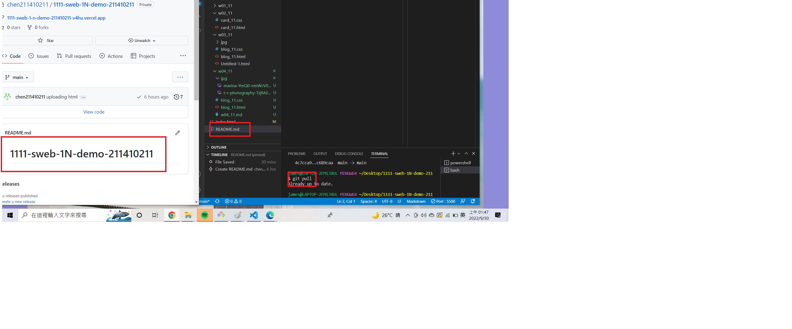
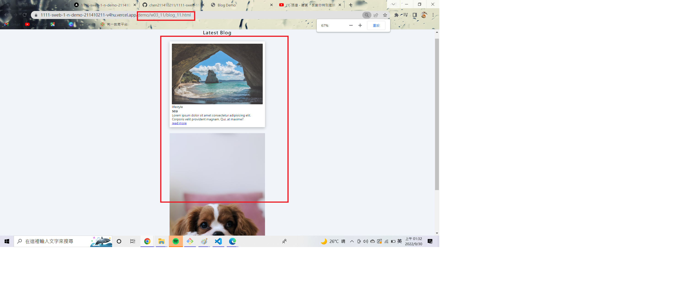
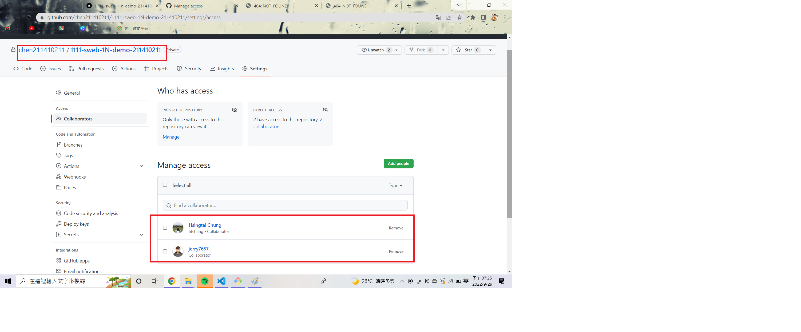
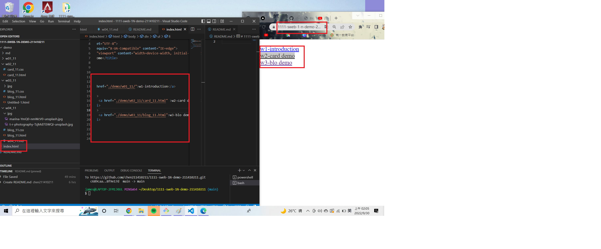
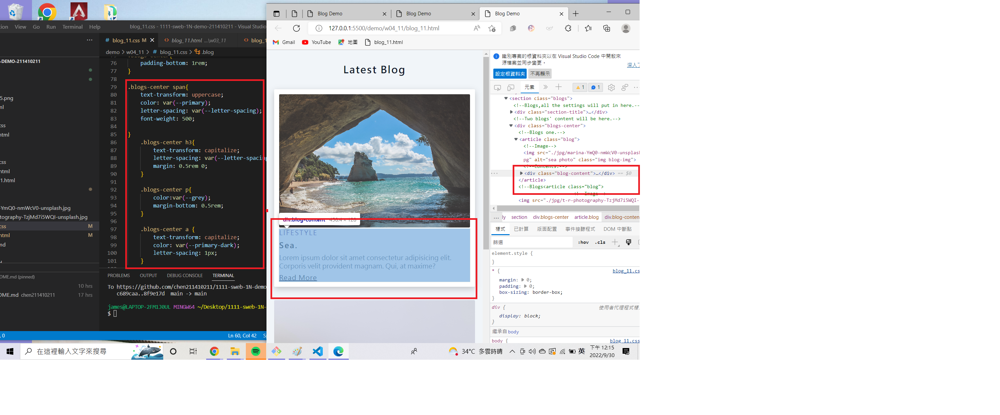
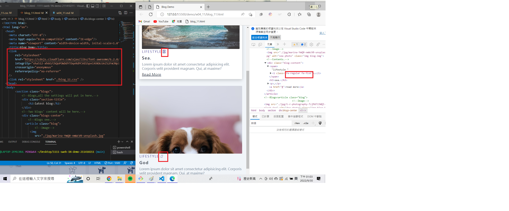

### W04-P1: Use git pull to update README.




### W04-P2: Deploy Github to Vercel



### W04-P3: Share Github repo to teacher and TA



### W04-P4: add index.html as homepage, and show in Vercel



### W04-P5: finish w03 blog demo with hover and transition



### W04-P6: Add font awesome css, add two icons



### w04-logs:W4 all logs 


```
 git log --pretty=format:"%h%x09%an%x09%ad%x09%s" --after="2022-09-28"
dd8930e chen211410211   Fri Sep 30 15:03:46 2022 +0800  t
8f9e17d chen211410211   Fri Sep 30 02:02:00 2022 +0800  w04-p4 add index.html as homepage
c689caa chen211410211   Thu Sep 29 20:10:03 2022 +0800  uploading html
4c7cca9 chen211410211   Thu Sep 29 19:10:14 2022 +0800  Create README.md
 
```