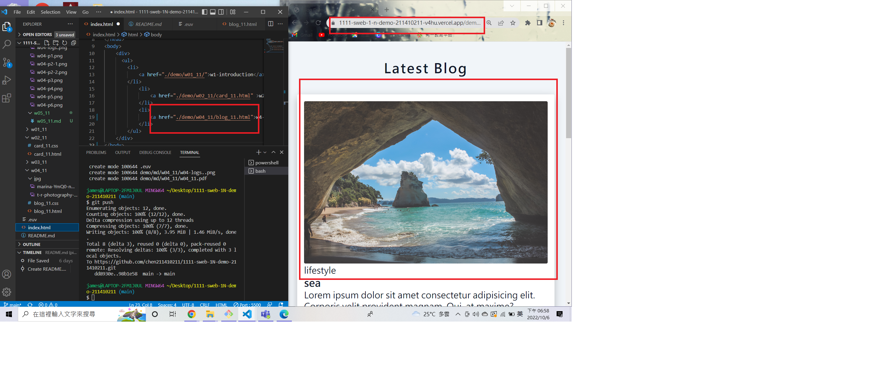
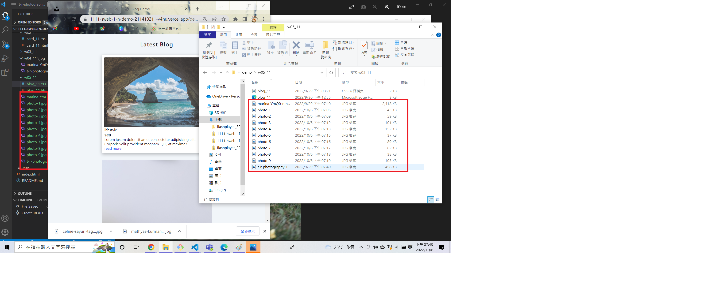
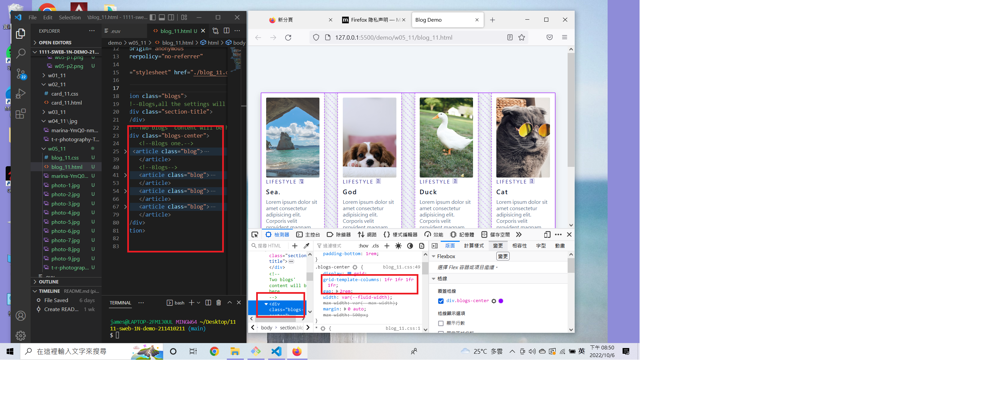
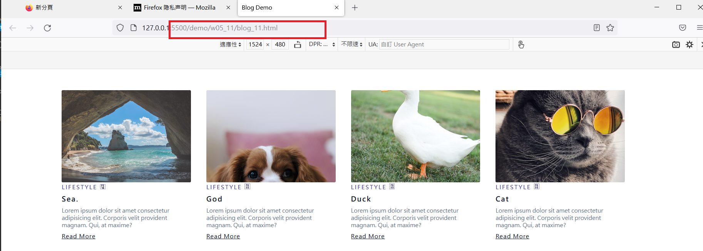
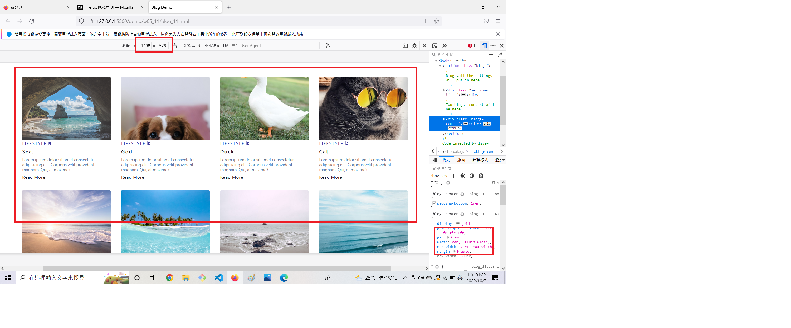
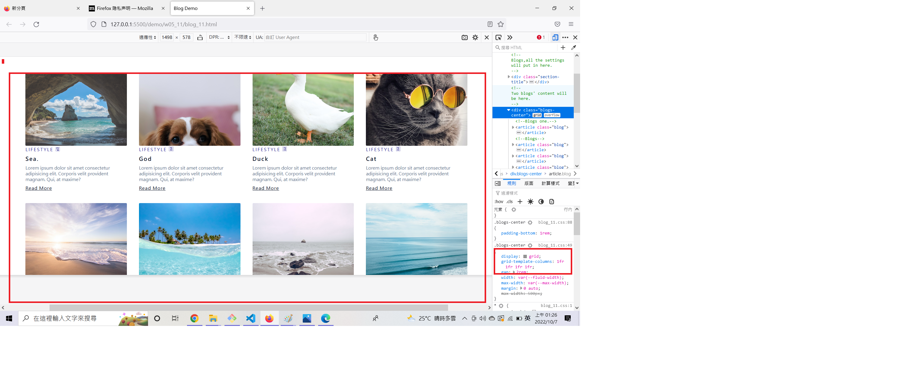
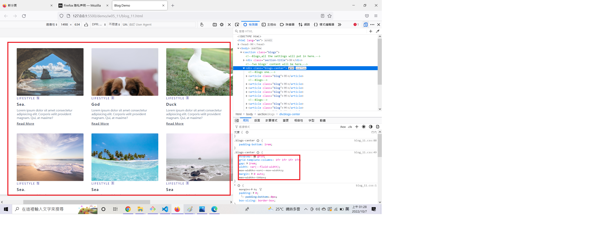
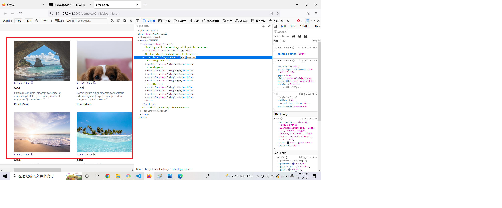
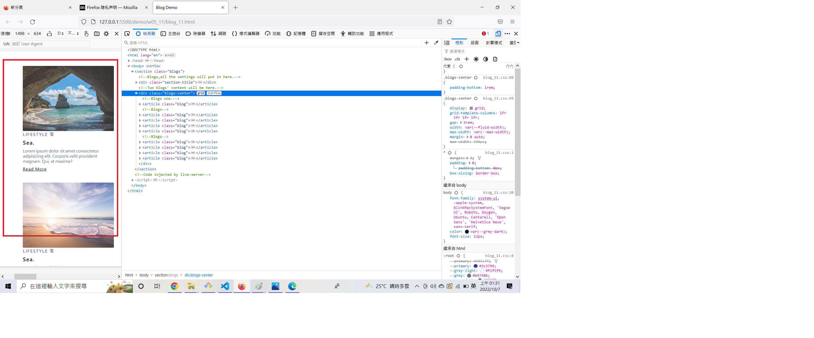

### Github repo ur1

[My Github repo](https://github.com/chen211410211/1111-sweb-1N-demo-211410211.git)

### W05-P1: add w04 link in index.html



### W05-P2: get 9 photo using small sizes



### W05-P3: Use grid to show 4 photos in a row



### W05-P4: Add w05 link in index.html, and show it in Vercel





### W05-P5: Using css grid with minmax to display 9 photos










### W05-logs: W4 all logs


```
 $ git log --pretty=format:"%h%x09%an%x09%ad%x09%s" --after="2022-10-05"
 6446385 htchung Thu Oct 6 21:17:37 2022 +0800   W05-P5: Using css grid with minmax to display 9 photos
 e0e1700 htchung Thu Oct 6 20:08:49 2022 +0800   add w05-p4.png
 b240dd0 htchung Thu Oct 6 20:06:17 2022 +0800   W05-P4: Add w05 link in index.html, and show it in Vercel
 20c3d43 htchung Thu Oct 6 20:03:30 2022 +0800   W05-P3: Use grid to show 4 photos in a row
 193f026 htchung Thu Oct 6 19:23:46 2022 +0800   W05-P2: get 9 photo using small sizes
 f524cc4 htchung Thu Oct 6 18:40:06 2022 +0800   W05-P1: add w04 link in index.html
 8e313b7 htchung Thu Oct 6 18:34:45 2022 +0800   add w04 link to index.htm
 
 ```
 


